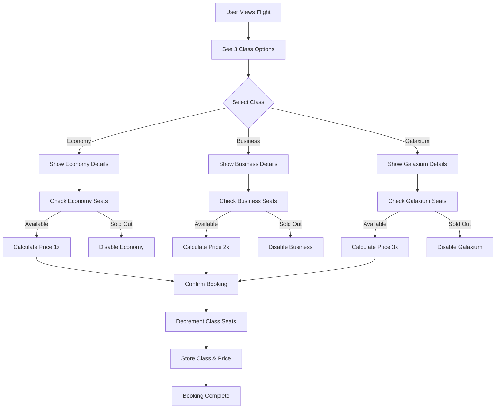
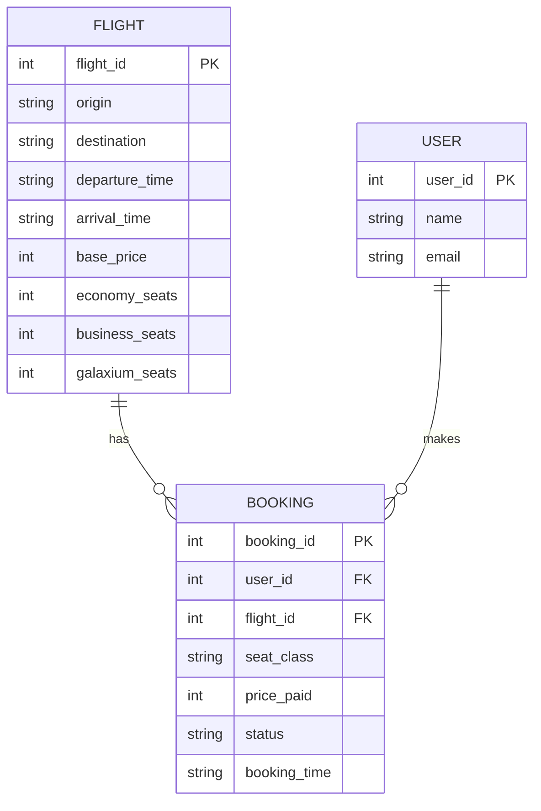

# Seat Classes Implementation Plan

## Overview
Implement three seat classes for Galaxium Travels: **Economy**, **Business**, and **Galaxium Class** with different pricing, separate seat inventories, user selection during booking, and displayed amenities.

## Design Decisions

### Pricing Model
- **Economy**: Base price (1x multiplier)
- **Business**: 1.5x base price
- **Galaxium Class**: 2.5x base price

### Seat Allocation
Each flight will have separate seat counts per class:
- Economy: Higher capacity (e.g., 10-20 seats)
- Business: Medium capacity (e.g., 5-10 seats)
- Galaxium Class: Limited capacity (e.g., 1-3 seats)

### Class Amenities
- **Economy**: Standard seating, Basic meals, Standard baggage
- **Business**: Extra legroom, Premium meals, Priority boarding, Increased baggage
- **Galaxium Class**: Luxury suite, Gourmet dining, VIP lounge access, Unlimited baggage, Personal concierge

---

## Backend Changes

### 1. Database Schema Updates

#### Current Flight Model
```python
class Flight(Base):
    flight_id = Column(Integer, primary_key=True)
    origin = Column(String, nullable=False)
    destination = Column(String, nullable=False)
    departure_time = Column(String, nullable=False)
    arrival_time = Column(String, nullable=False)
    price = Column(Integer, nullable=False)  # Base price
    seats_available = Column(Integer, nullable=False)  # Total seats
```

#### New Flight Model
```python
class Flight(Base):
    flight_id = Column(Integer, primary_key=True)
    origin = Column(String, nullable=False)
    destination = Column(String, nullable=False)
    departure_time = Column(String, nullable=False)
    arrival_time = Column(String, nullable=False)
    base_price = Column(Integer, nullable=False)  # Economy price
    economy_seats = Column(Integer, nullable=False)
    business_seats = Column(Integer, nullable=False)
    galaxium_seats = Column(Integer, nullable=False)
```

#### Current Booking Model
```python
class Booking(Base):
    booking_id = Column(Integer, primary_key=True)
    user_id = Column(Integer, ForeignKey('users.user_id'))
    flight_id = Column(Integer, ForeignKey('flights.flight_id'))
    status = Column(String, nullable=False)
    booking_time = Column(String, nullable=False)
```

#### New Booking Model
```python
class Booking(Base):
    booking_id = Column(Integer, primary_key=True)
    user_id = Column(Integer, ForeignKey('users.user_id'))
    flight_id = Column(Integer, ForeignKey('flights.flight_id'))
    seat_class = Column(String, nullable=False)  # 'economy', 'business', 'galaxium'
    price_paid = Column(Integer, nullable=False)  # Actual price paid
    status = Column(String, nullable=False)
    booking_time = Column(String, nullable=False)
```

### 2. Schema Updates (Pydantic)

#### FlightOut Schema
```python
class FlightOut(BaseModel):
    flight_id: int
    origin: str
    destination: str
    departure_time: str
    arrival_time: str
    base_price: int
    economy_seats: int
    business_seats: int
    galaxium_seats: int
    
    # Computed fields for convenience
    @property
    def business_price(self) -> int:
        return int(self.base_price * 1.5)
    
    @property
    def galaxium_price(self) -> int:
        return int(self.base_price * 2.5)
```

#### BookingRequest Schema
```python
class BookingRequest(BaseModel):
    user_id: int
    name: str
    flight_id: int
    seat_class: Literal['economy', 'business', 'galaxium']
```

#### BookingOut Schema
```python
class BookingOut(BaseModel):
    booking_id: int
    user_id: int
    flight_id: int
    seat_class: str
    price_paid: int
    status: str
    booking_time: str
```

### 3. Service Layer Updates

#### [`booking.book_flight()`](booking_system_backend/services/booking.py:7)
- Add `seat_class` parameter
- Validate seat class is valid ('economy', 'business', 'galaxium')
- Check availability for specific class
- Calculate price based on class (base_price * multiplier)
- Decrement appropriate seat count
- Store seat_class and price_paid in booking

#### [`booking.cancel_booking()`](booking_system_backend/services/booking.py:57)
- Restore seat to appropriate class based on booking.seat_class
- No major logic changes needed

#### [`booking.get_bookings()`](booking_system_backend/services/booking.py:85)
- Return bookings with seat_class and price_paid
- No major logic changes needed

### 4. API Endpoints Updates

#### REST Endpoints (server.py)
- Update POST `/bookings` to accept seat_class in request body
- Update response models to include seat_class and price_paid
- Update GET `/flights` response to include all seat counts

#### MCP Tools
- Update `book_flight` tool to accept seat_class parameter
- Update tool descriptions to mention class selection
- Update error messages for class-specific scenarios

### 5. Seed Data Updates

Update [`seed.py`](booking_system_backend/seed.py:6) to create flights with class-based seats:
```python
flights = [
    Flight(
        origin="Earth", 
        destination="Mars",
        departure_time="2099-01-01T09:00:00Z",
        arrival_time="2099-01-01T17:00:00Z",
        base_price=1000000,
        economy_seats=15,
        business_seats=8,
        galaxium_seats=2
    ),
    # ... more flights
]
```

---

## Frontend Changes

### 1. Type Updates

#### [`types/index.ts`](booking_system_frontend/src/types/index.ts:3)
```typescript
export type SeatClass = 'economy' | 'business' | 'galaxium';

export interface Flight {
  flight_id: number;
  origin: string;
  destination: string;
  departure_time: string;
  arrival_time: string;
  base_price: number;
  economy_seats: number;
  business_seats: number;
  galaxium_seats: number;
}

export interface Booking {
  booking_id: number;
  user_id: number;
  flight_id: number;
  seat_class: SeatClass;
  price_paid: number;
  status: 'booked' | 'cancelled' | 'completed';
  booking_time: string;
}

export interface BookingRequest {
  user_id: number;
  name: string;
  flight_id: number;
  seat_class: SeatClass;
}

export interface SeatClassInfo {
  name: string;
  price: number;
  available: number;
  amenities: string[];
  multiplier: number;
}
```

### 2. New Components

#### `SeatClassSelector.tsx`
A component to display and select seat classes with:
- Visual cards for each class
- Price display (calculated from base_price)
- Available seats count
- Amenities list
- Selection state
- Sold out state handling

#### `SeatClassBadge.tsx`
A small badge component to display seat class with appropriate styling:
- Economy: Blue/standard color
- Business: Purple/premium color
- Galaxium: Gold/luxury gradient

### 3. Component Updates

#### [`FlightCard.tsx`](booking_system_frontend/src/components/flights/FlightCard.tsx:12)
- Display all three class options with prices
- Show availability for each class
- Update "Book Now" to show class selection
- Add visual indicators for class availability

#### [`BookingModal.tsx`](booking_system_frontend/src/components/bookings/BookingModal.tsx:17)
- Add SeatClassSelector component
- Update price display based on selected class
- Show selected class amenities
- Pass seat_class to booking API call
- Validate class selection before booking

#### [`BookingCard.tsx`](booking_system_frontend/src/components/bookings/BookingCard.tsx)
- Display seat class badge
- Show price paid (not base price)
- Add class-specific styling

### 4. Utility Functions

#### Price Calculation Helper
```typescript
export const calculateClassPrice = (basePrice: number, seatClass: SeatClass): number => {
  const multipliers = {
    economy: 1,
    business: 1.5,
    galaxium: 2.5
  };
  return Math.floor(basePrice * multipliers[seatClass]);
};

export const getSeatClassInfo = (
  flight: Flight,
  seatClass: SeatClass
): SeatClassInfo => {
  const amenities = {
    economy: ['Standard seating', 'Basic meals', 'Standard baggage'],
    business: ['Extra legroom', 'Premium meals', 'Priority boarding', 'Increased baggage'],
    galaxium: ['Luxury suite', 'Gourmet dining', 'VIP lounge access', 'Unlimited baggage', 'Personal concierge']
  };
  
  const seats = {
    economy: flight.economy_seats,
    business: flight.business_seats,
    galaxium: flight.galaxium_seats
  };
  
  const multipliers = { economy: 1, business: 1.5, galaxium: 2.5 };
  
  return {
    name: seatClass.charAt(0).toUpperCase() + seatClass.slice(1),
    price: calculateClassPrice(flight.base_price, seatClass),
    available: seats[seatClass],
    amenities: amenities[seatClass],
    multiplier: multipliers[seatClass]
  };
};
```

---

## Testing Strategy

### Backend Tests

#### Unit Tests (test_services.py)
- Test booking with each seat class
- Test price calculation for each class
- Test seat availability per class
- Test booking when specific class is sold out
- Test cancellation restores correct class seats
- Test invalid seat class rejection

#### Integration Tests (test_rest.py)
- Test POST /bookings with seat_class
- Test GET /flights returns class-based seats
- Test GET /bookings returns seat_class and price_paid

### Frontend Tests
- TypeScript compilation with new types
- Manual testing of booking flow with class selection
- Visual testing of class selector component
- Test sold-out class handling

---

## Migration Strategy

### Database Migration
Since the system uses SQLite with seed-on-startup:
1. Update models.py with new schema
2. Update seed.py to create class-based flights
3. Server restart will recreate database with new schema
4. No manual migration needed (development environment)

### Backward Compatibility
Not required - system reseeds on startup, no production data to migrate.

---

## Implementation Order

1. **Backend Models & Schema** - Foundation for all changes
2. **Service Layer** - Business logic for class-based bookings
3. **API Endpoints** - Expose new functionality
4. **Seed Data** - Test data with classes
5. **Frontend Types** - TypeScript definitions
6. **UI Components** - Visual elements for class selection
7. **Integration** - Connect frontend to backend
8. **Testing** - Verify end-to-end functionality

---

## Visual Design Considerations

### Color Scheme per Class
- **Economy**: `text-blue-400` / `bg-blue-500/20`
- **Business**: `text-cosmic-purple` / `bg-cosmic-purple/20`
- **Galaxium**: `text-alien-green` / `bg-gradient-to-r from-alien-green to-solar-orange`

### Icons
- Economy: Standard seat icon
- Business: Premium seat icon with star
- Galaxium: Luxury seat icon with crown/sparkle

---

## Success Criteria

- ✅ Users can see three seat classes for each flight
- ✅ Each class shows correct price (1x, 2x, 3x base)
- ✅ Separate seat availability per class
- ✅ Users can select preferred class during booking
- ✅ Amenities displayed for each class
- ✅ Bookings show which class was booked
- ✅ Sold-out classes are disabled but visible
- ✅ Cancellations restore seats to correct class
- ✅ All tests pass with new functionality

---

## Mermaid Diagrams

### Booking Flow with Seat Classes



### Database Schema Relationship



---

## Notes

- The system maintains backward compatibility in service layer patterns (Union return types)
- Frontend uses existing component patterns (Modal, Card, Button)
- Tailwind custom colors from theme are utilized for class styling
- MCP and REST endpoints share same service layer logic
- Database reseeds on every restart (no migration complexity)
